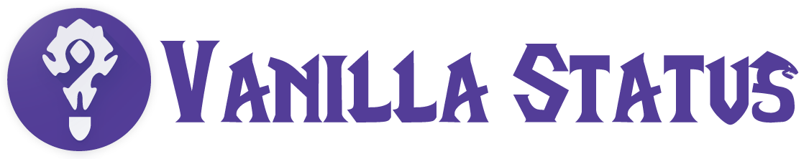

> Backend Services built to support ElysiumStatus Mobile App.

* **Current Status**: Development

* **
# Getting Started
These instructions will get you a copy of the project up and running on your local machine for development and testing purposes.

## Prerequisites
### FCM Api key (Push Notifications)

1. Visit https://firebase.google.com/ and create a free account.
2. Create a new project
3. Create an app if one is not created
4. Click on the cog in the top left
5. Select `Project Settings`
6. Select `Cloud Messaging`
7. Copy the `Server key`
8. Create & Add Server key to  `~/.fcm/creds.json` (Structure Below)
9. Done!

**creds.json structure**
```json
{
    "key": "Server Key"
}
```
### Running poll scripts
```sh
npm install

npm start
```

## Getting involved
Full contribution guidelines listed in [CONTRIBUTING.md](CONTRIBUTING.md)

### Bug Reports
Please submit all bug reports through the repository's Issue Tracker and they will be tagged and prioritized.

### Product Roadmap
List of features where help is desired.

1. Push Notifications - Topic Driven Realm status notifications
2. Realm Status Api (Lambda Driven)
3. Driven Realm Stats Api (Lambda Driven)
4. Be Less Volatile (Persist Data - File or DB)

## Versioning
We use [SemVer](http://semver.org/) for versioning.

## Authors
* [emmoistner](https://github.com/emmoistner) - *Initial work*

## License
This project is licensed under the MIT License - see the [LICENSE.md](LICENSE.md) file for details
